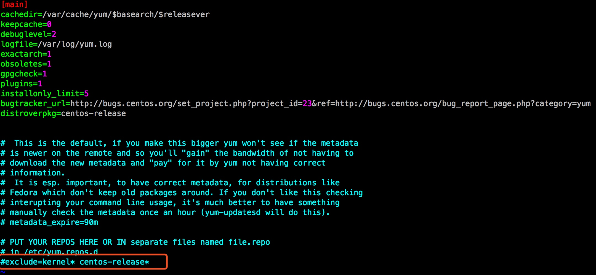

# Kubernetes install log
##disable SeLinux
    setenforce 0
    sed -i "s/enable/disabled/g" selinux
##Set Hostname
    echo "hostname" > /etc/hostname
##不启动图形化
###CentOS 7
    systemctl get-default   #查看当前状态
    systemctl set-default multi-user.target     #设置不以图形化界面启动
###CentOS 6
    vim /etc/inittab    
    id:3:initdefault:   

##升级内核
###使用elrepo源升级内核

    rpm --import https://www.elrepo.org/RPM-GPG-KEY-elrepo.org
    rpm -Uvh http://www.elrepo.org/elrepo-release-7.0-2.el7.elrepo.noarch.rpm
    yum --enablerepo=elrepo-kernel install  kernel-ml-devel kernel-ml
    awk -F\' '$1=="menuentry " {print $2}' /etc/grub2.cfg
    grub2-set-default 0
如果无法访问外网，可以将kernel文件下载使用`rpm`方式安装,可以先去[http://elrepo.org/linux/kernel/el7/x86_64/RPMS/] 下载

    rpm -ivh  kernel-ml-devel-4.10.5-1.el7.elrepo.x86_64.rpm
    rpm -ivh kernel-ml-4.10.5-1.el7.elrepo.x86_64.rpm

**为了确保内核的稳定，默认情况下，可以在yum的配置文件/etc/yum.conf中加了exclude=kernel\* centos-release\*，这样可以防止在装软件包时无意更新内核相关的东西。 如果确实需要安装此软件包，将/etc/yum.conf中的这行代码注释即可。[如果在安装过程中提示未找到kernel包，亦需检查此项配置:[Ucloud]]**
  

###源码编译方式

    yum install -y kernel-devel gcc gcc-c++ bc openssl  openssh openssl-devel
    wget -c https://cdn.kernel.org/pub/linux/kernel/v4.x/linux-4.9.tar.xz
    tar xvf linux-4.9.tar.xz
    
    cd linux-4.9
    uname -r
    cp /boot/config-3.10.0-123.el7.x86_64 .config
    sh -c 'yes "" | make oldconfig'
    make -j4 bzImage
    make -j4 modules
    make -j4 modules_install
    make install
    awk -F\' '$1=="menuentry " {print $2}' /etc/grub2.cfg
    grub2-set-default 0

